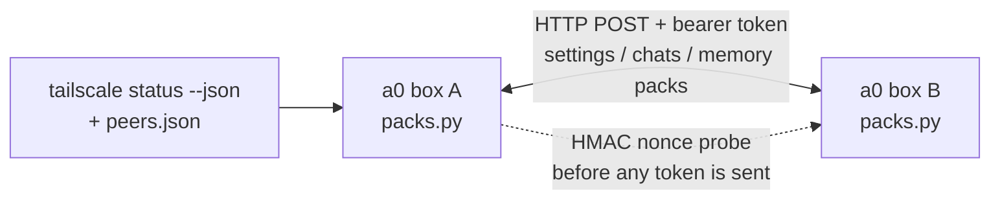

<p align="center">
  <picture>
    <source media="(prefers-color-scheme: dark)" srcset="assets/brand/wordmark-dark.svg">
    
  </picture>
</p>

Move secret-free settings, chats and memory atoms between your own [Agent Zero](https://github.com/agent0ai/agent-zero) instances over Tailscale or a manual peers list.

Status: 0.1.0, disabled by default, single operator, stdlib only. Roadmap: [ROADMAP.md](ROADMAP.md). Logo and design are proposals ([DESIGN.md](DESIGN.md)).

<!-- TODO: screenshot of the settings panel from a running a0 -->

Ported from the Khan fork's `device_sync` and `continuity_sync` helpers onto stock a0's plugin surface, with no upstream edits.

## Install

Drop the repo contents into `usr/plugins/device_sync/` (underscore). The directory name is the plugin name and is what the imports and the `/api/plugins/device_sync/*` routes key on; the repo is `a0-plugin-device-sync` but the install path must be `device_sync`.

## Quick start

1. Set a shared token on every box (same value): `DEVICE_SYNC_TOKEN=<secret>`.
2. Set `DEVICE_SYNC_ENABLED=true` (or `enabled: true` in the plugin config).
3. Make peers reachable: on one tailnet they are discovered via `tailscale status --json`; otherwise list them in `~/.a0-device-sync/peers.json` as `[{"name": "...", "host": "...", "port": 80}]`.
4. Trigger a sync: POST `/api/plugins/device_sync/sync_now` with `{"peer": "<name>", "direction": "push" | "pull" | "bidirectional"}` and the header `Authorization: Bearer <token>`. Omit `peer` to sync every discovered peer.
5. Optional: `auto_sync_interval_s: 300` for a background bidirectional sync (60 s floor, never starts without a token).

## How it works



## What it syncs

| Pack | Format | Notes |
|---|---|---|
| settings | JSON `khan-settings` v1 | secrets scrubbed on export AND dropped on import — local secrets always win |
| chats | ZIP `khan-chats` v1 | manifest + `chats/<ctxid>.json` + kurultai NDJSON; import dedupes by original `ctxid` — **plugin-side** (stock `load_json_chats` deletes `id` and mints fresh ones, so the plugin filters known ids before deserializing) |
| memory | NDJSON atoms | pluggable backend (`MemoryBackend` protocol); import idempotent by atom `id` |

Pack format tags keep the `khan-` prefix on purpose — a Khan box and a stock-a0
box running this plugin can sync with each other.

## How sync works

Peers are other a0 instances reachable on your Tailscale tailnet. Discovery
unions `tailscale status --json` with `~/.a0-device-sync/peers.json`
(a JSON list of `{"name", "host", "port?"}` — entries with invalid ports
are skipped, not fatal). Each candidate is probed on `peer_port` (default
80 — the plugin's endpoints ride a0's normal HTTP port) with an
**identity probe**: an unauthenticated request carrying a fresh nonce
(`X-Device-Sync-Nonce`); the box must answer 403 with an HMAC-SHA256 proof
of the shared token over that nonce. A bare open port is not a peer, and the
token itself never rides the probe, so a hostile peers-file entry or a
non-a0 service cannot harvest it. The proof shows the peer shares the
token, not that it is the host you meant: a relay through a real peer can
answer the challenge. Sync directions: `push`, `pull`,
`bidirectional`.

Endpoints (all POST, all gated by a shared bearer token):

```
/api/plugins/device_sync/settings_export   settings_import
/api/plugins/device_sync/chats_export      chats_import
/api/plugins/device_sync/memory_export     memory_import
/api/plugins/device_sync/peers             sync_now
```

Peer auth: `Authorization: Bearer <sync_token>` (or `X-Device-Sync-Token`).
This is machine-to-machine traffic — session auth can't ride a urllib client
and CSRF is meaningless without cookies, so the handlers declare both off and
enforce the token themselves. **Empty token = every endpoint refuses.**

Settings never auto-merge in a bidirectional sync — it writes settings in
**neither** direction; differing keys are returned in `settings_conflicts`
for manual review. (Push and pull still apply settings — those are the
explicit merge directions.) Chats and memory atoms converge by idempotent
id-based import.

## Config

| Key | Default | Env | Meaning |
|---|---|---|---|
| `enabled` | `false` | `DEVICE_SYNC_ENABLED` | master switch; inert when off |
| `sync_token` | empty | `DEVICE_SYNC_TOKEN` | shared bearer token; empty refuses every endpoint |
| `peers_file` | empty (`~/.a0-device-sync/peers.json`) | `DEVICE_SYNC_PEERS_FILE` | manual peer list |
| `peer_port` | `80` | `DEVICE_SYNC_PEER_PORT` | port peers are probed and served on |
| `auto_sync_interval_s` | `0` | `DEVICE_SYNC_INTERVAL_S` | background loop cadence; 0 = off, 60 s floor |
| `http_timeout_s` | `60` | `DEVICE_SYNC_TIMEOUT_S` | transfer timeout |
| `memory_backend` | `none` | `DEVICE_SYNC_MEMORY_BACKEND` | `none` or `git` |
| `memory_dir` | empty | `DEVICE_SYNC_MEMORY_DIR` | git atom store path |

Details:

`default_config.yaml` shows every key; env overrides: `DEVICE_SYNC_ENABLED`,
`DEVICE_SYNC_TOKEN`, `DEVICE_SYNC_PEERS_FILE`, `DEVICE_SYNC_PEER_PORT`,
`DEVICE_SYNC_INTERVAL_S`, `DEVICE_SYNC_TIMEOUT_S`, `DEVICE_SYNC_MEMORY_BACKEND`,
`DEVICE_SYNC_MEMORY_DIR`.

- `enabled: false` by default — the plugin is inert until you turn it on.
- `sync_token` empty by default — required before any endpoint answers.
- `auto_sync_interval_s: 0` — manual sync only; set e.g. `300` for a
  background thread that bidirectional-syncs every discovered peer.
  Clamped to a 60s floor, and the loop never starts without a token
  (it would only produce 403s).

## Memory backends

`memory_backend: none` (default) — memory sync reports "unsupported", the
same graceful state a peer without memory endpoints shows.

`memory_backend: git` — MemFS-style: `memory_dir` is a git repo of
`<atom_id>.json` files. Import writes + commits; push/pull are real git
operations (`backend.pull()` / `backend.push()`), so backup, `git diff`,
and `git revert` rollback all come free. Missing git binary or repo dir
degrades to an empty store — never raises into a sync.

Custom: a sibling plugin (e.g. a Kurultai store) can fill the seam:

```python
from usr.plugins.device_sync.helpers import runtime
runtime.register_memory_backend("kurultai", lambda cfg: MyStore(cfg))
```

Implement `export_atoms() -> list[dict]`, `has_atom(id) -> bool`,
`import_atoms(atoms) -> int`. Register before `configure()` runs (e.g. in
your plugin's earlier-numbered `startup_migration` extension).

## Safety

- ZIP extraction is bounded: upload cap (50 MiB), entry count (5000),
  per-entry (20 MiB) and total (200 MiB) uncompressed sizes, compression
  ratio guard. Entries are read to memory only — member names never reach
  a filesystem path, so traversal is structurally impossible.
- Secrets never leave the box: `SENSITIVE_SETTINGS_KEYS` plus
  pattern-matched capability keys (`mcp_servers`, `*_kwargs`, `*_path`,
  `*_url`, …) are scrubbed from exports and dropped from imports — a
  settings overlay can never smuggle in an MCP server spec or a working
  directory.
- The HTTP client follows **no redirects** and ignores ambient HTTP
  proxies — either would forward `Authorization: Bearer` to a host you
  didn't configure. Responses are read capped at the upload cap + 1.
- Import endpoints report domain errors in-band as `{"ok": false}` at
  HTTP 200 (a0 serializes handler dicts); the client checks the envelope,
  so a rejected pack never reads as a success.
- Peer failures degrade per-step: one unreachable endpoint fails that pack
  type, not the whole sync; a 404 memory endpoint = "peer doesn't support
  memory yet", not an error. A contended manual/auto sync reports busy
  instead of queueing.

## Not covered here

Risks noted from reading the code, documented in [the landscape doc](docs/research/2026-10-10-landscape.md): one shared token for all peers with no rotation; default port 80 is plain HTTP (fine on a tailnet, not off it); imported chats and memory enter the agent's context, so treat every peer as fully trusted.

## Tests

```bash
python -m pytest tests/ -q
```

No external services needed — the HTTP seam is stubbed in tests.

## State the plugin doesn't own

- `~/.a0-device-sync/` — peers file, sync log/state. Survives uninstall on
  purpose; delete manually to forget everything.
- `usr/kurultai-inbox/chats/` — kurultai NDJSON pulled from peers is
  dropped here for the host's own ingestion path.
- `hooks.py uninstall` stops the auto-sync thread and unregisters memory
  backends; it does not delete either directory.

## Status / limits

- Plugin has no web UI yet; there is no screenshot to show.

- Peer detection is an HTTP identity probe (see above) — it proves "an a0
  with this plugin answers", not just "a port is open".
- No pack encryption — the threat model is tailnet transport security plus
  the shared token. Secrets don't cross the wire regardless.
- Settings conflict resolution is manual by design.
- Chat dedupe preserves the *origin* ctxid — which means a chat synced
  A→B→A is recognized as the same chat (good), and two genuinely distinct
  local chats can never share a ctxid because a0 assigns ids.

## Contributing

Issues and PRs welcome. Run `python -m pytest tests/ -q` first (no network, tailscale or git needed). Read [AGENTS.md](AGENTS.md) for the conventions; do not rename the `khan-*` pack tags.

## Licence

MIT. See [LICENSE](LICENSE) and [NOTICE](NOTICE).
